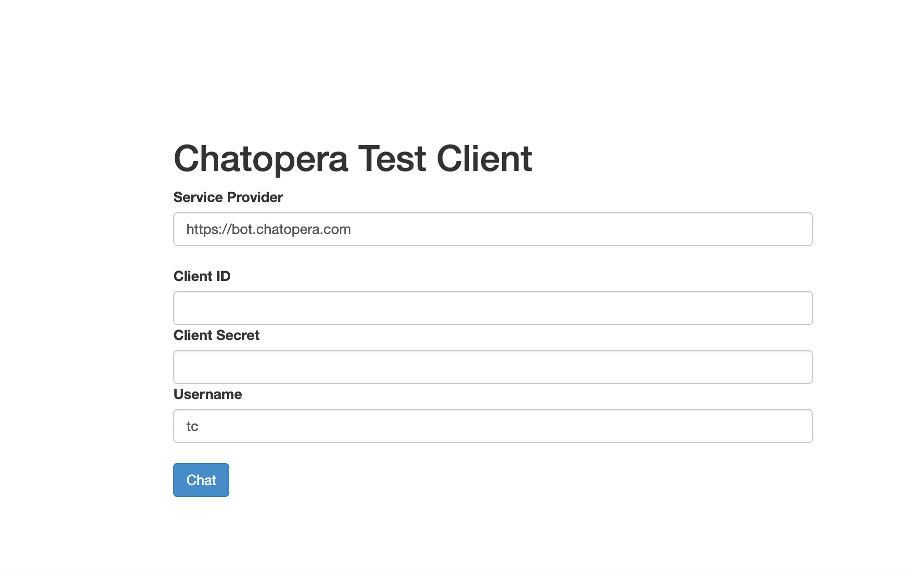

# efaqa-bot-demo

心理问答机器人示例程序，通过集成`Chatopera 心智能`实现心理问答服务。

## TL;DR

```
cd app
npm install
cp app/sample.env app/.env # edit .env, add client id and secret
../admin/demo.sh
open app/demo.js
```

修改文本，进行测试，编辑[sample.json](./assets/sample.json)。

```
{
  "search": {
    "threshold": 0.2,
    "data": [
      "最近感觉有轻生的念头，是有抑郁症吗？",
      "孩子总是咬指甲怎么办需不需要看心里医生",
      "总是感觉不到快乐，不开心。内心很脆弱"
    ]
  },
  "chat": {
    "channel": "node-test",
    "channelId": "channel1",
    "userId": "user001",
    "data": [
      "怀疑自己得抑郁症了",
      "20岁",
      "经常感到没有活力"
    ]
  }
}

```

## 使用文档

[https://docs.chatopera.com/products/psych-assistant/api.html](https://docs.chatopera.com/products/psych-assistant/api.html)

[使用文档](https://docs.chatopera.com/products/psych-assistant/api.html)，文档中详细介绍，心理问答 API、账号创建、其它语言 SDK 和接口等内容。

## 对话示例程序

为了方便用户体验和测试，同时提供一个 Web 应用，该 Web 应用源码也在`./app`内，该示例程序仅用于调试和体验。


启动对话示例程序：

```
cd app
npm i
npm run serve
```

在控制台内看到如下日志，代表程序启动成功。

```
Chatopera Test Client Listening on port 8668
```

在浏览器内打开地址`http://localhost:8668/`，进入登录页面。



填入`Client ID`和`Client Secret`开始使用。

### 使用 docker 运行

\*前提准备：安装 docker 服务。

如果不想安装 Node.js 环境，进一步简化的运行方式是使用 docker，我们提供了 docker 镜像[chatopera/efaqa-bot-tc](https://hub.docker.com/r/chatopera/efaqa-bot-tc/)，使用如下命令立即启动。

```
./admin/docker.sh
```

## 其它链接

[Chatopera 云服务](https://bot.chatopera.com)

[Chatopera Node.js SDK](https://www.npmjs.com/package/@chatopera/sdk)

## 开源许可协议

Copyright (2018-2020) <a href="https://www.chatopera.com/" target="_blank">北京华夏春松科技有限公司</a>

[MIT](https://github.com/chatopera/efaqa-bot-demo/blob/master/LICENSE)

[![chatoper banner][co-banner-image]][co-url]

[co-banner-image]: https://user-images.githubusercontent.com/3538629/42383104-da925942-8168-11e8-8195-868d5fcec170.png
[co-url]: https://www.chatopera.com
